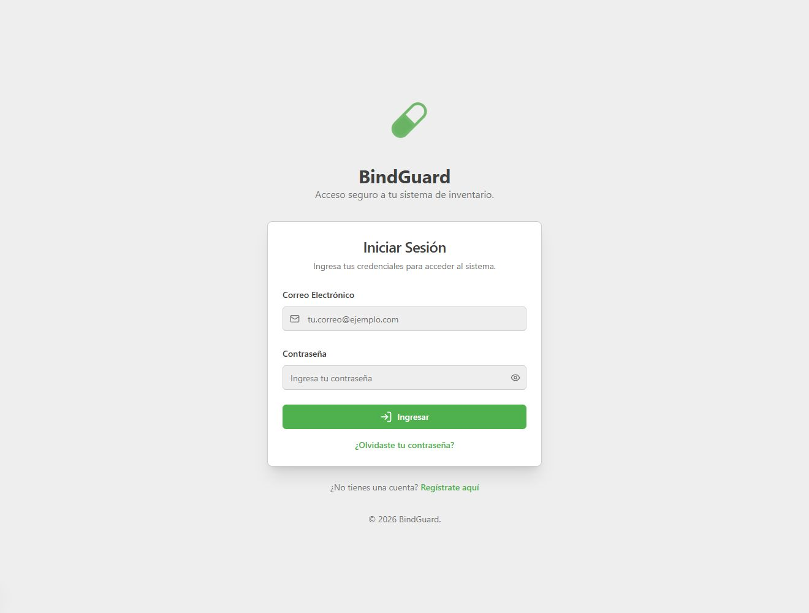
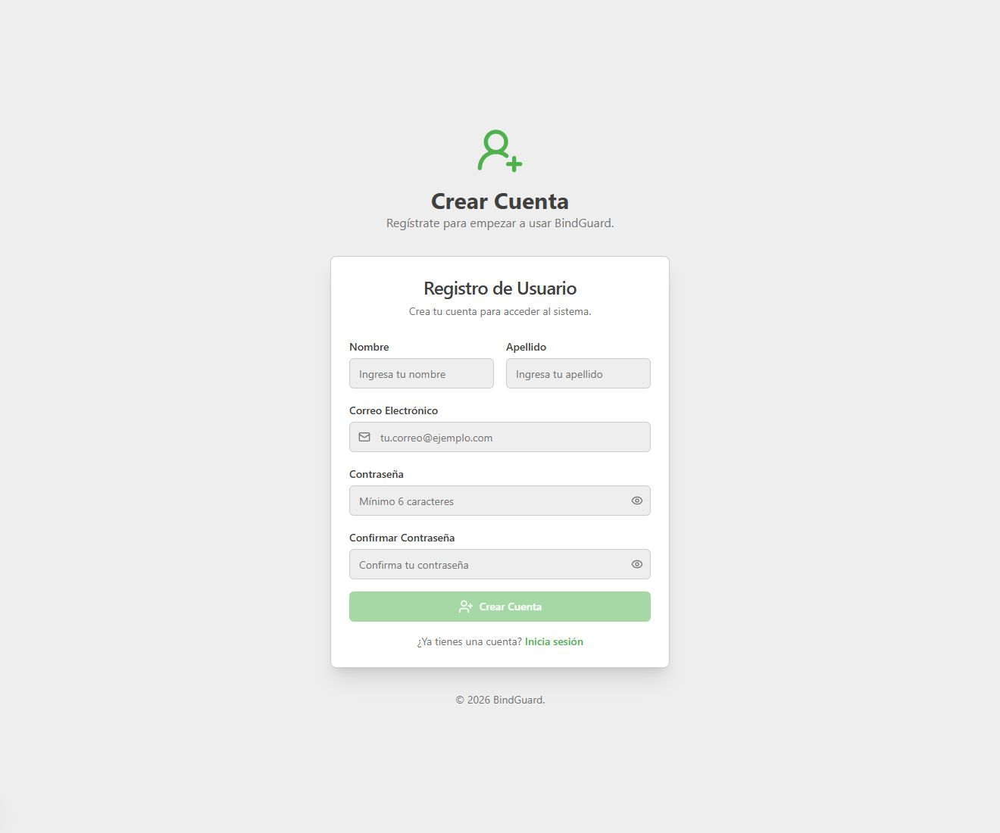
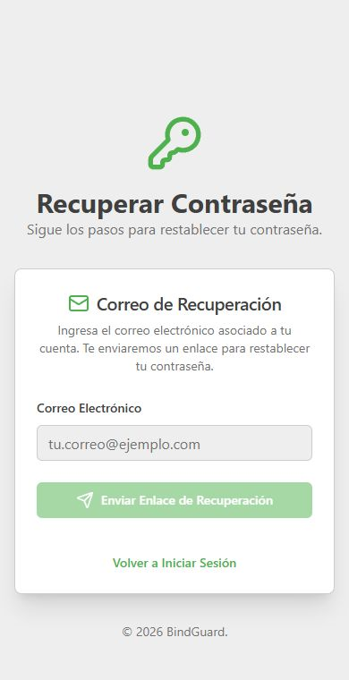

# BindGuard

BindGuard is a web application for pharmacy inventory control, medicine dispensing, stock entries, QR-based identification, and traceability of medicine movements.

**Current version:** secure inventory API, atomic prescription dispensing, explicit user roles, responsive Bindcard grid, and Firebase App Hosting continuous deployment.

**Production:** https://bindguard--rxlocal-inventory.us-east4.hosted.app

It was built with **Next.js 15**, **TypeScript**, **Firebase Authentication**, **Cloud Firestore**, **Tailwind CSS**, and **Genkit / Google AI**. The application is designed to work well on desktop and mobile devices and focuses on replacing manual inventory cards with a digital workflow.

## Interface preview

### Login



### User registration



### Password recovery on mobile

<p align="center">
  
</p>

## Overview

BindGuard organizes pharmacy inventory around digital medicine records called **Bindcards**. Each medicine stores its current stock and a chronological history of stock entries and dispensing operations.

Authenticated users can:

- Browse the medicine inventory.
- Identify medicines by QR code or manual code.
- Dispense one or more medicines against a prescription number.
- Add stock and record expiration dates.
- Review medicine movement history.
- Continue an interrupted prescription workflow using locally saved progress.

Administrators additionally have access to medicine and user management features.

The project also contains an experimental AI-assisted prescription scanning module that extracts information from a photographed prescription.

## Main features

### Authentication and users

BindGuard uses Firebase Authentication for email/password authentication and Cloud Firestore for user profiles.

Features include:

- Login and registration.
- Password recovery by email.
- Protected application routes.
- User profiles stored in Firestore.
- Explicit `admin`, `operator`, `viewer`, and `pending` roles.
- Administrative user management screens.
- New registrations start as `pending` and require administrative approval before operating inventory.

### Medicine inventory — Bindcards

Each medicine is stored as a Firestore document containing information such as:

- Medicine ID / code.
- Name.
- Presentation.
- Description.
- Current stock.
- Last update timestamp.
- Blocked / active status.
- Complete dispensing and stocking history.

The inventory interface loads the current information directly from Firestore and displays the medicines as digital **Bindcards**. The list uses one column on mobile and laptops and two columns on wide desktop screens, with search and visible result counts.

### Medicine dispensing

The dispensing workflow allows a user to create a prescription transaction and progressively add medicines to it.

Typical flow:

1. Enter a prescription number.
2. Select the prescription date.
3. Scan or manually enter a medicine code.
4. Validate that the medicine exists and is active.
5. Enter the quantity to dispense.
6. Add additional medicines if required.
7. Review the prescription.
8. Confirm the operation and update inventory.

BindGuard validates available stock before allowing a medicine to be dispensed.

Stock updates are sent to authenticated Next.js server endpoints. Firebase Admin verifies the caller and the server executes an idempotent Firestore transaction. Multi-medicine prescriptions are committed atomically: either every requested stock movement succeeds or none is written.

### QR scanning

Medicine identification supports QR scanning using the device camera through `qr-scanner`.

A QR code may contain either:

- A raw medicine identifier, or
- JSON containing an `id` field.

The detected medicine code is checked against Firestore before the transaction continues.

Manual code entry is also available when a camera cannot be used.

### Stock entry / re-entry

The stock workflow adds medicine quantities back into inventory.

Stock entries can store:

- Medicine code.
- Quantity received.
- Transaction/reference number.
- User responsible for the movement.
- Date of the transaction.
- Expiration date.

An expiration date is required when new stock is added.

### Inventory movement history

Every medicine contains a movement history.

Two transaction types are currently modeled:

- `dispensed` — stock leaves inventory.
- `stocked` — stock enters inventory.

History records may contain the transaction date, prescription/reference number, quantity, user, and expiration date where applicable.

This history is used to provide traceability and can also be used to reconstruct stock after administrative corrections.

### Medicine administration

The project contains an administration area with pages for:

- Adding medicines.
- Editing medicine information.
- Viewing inventory.
- Blocking or re-enabling medicines.
- Managing users.

Blocked medicines cannot be dispensed or receive new stock until they are enabled again.

### Prescription progress recovery

The dispensing workflow stores an in-progress prescription in browser `localStorage`.

If the browser is refreshed or the user returns before completing the transaction, BindGuard can restore:

- Prescription number.
- Prescription date.
- Medicines already added.

This reduces the chance of losing partially entered work.

## Experimental AI prescription scanner

BindGuard includes an experimental module for extracting structured data from photographs of medical prescriptions.

The module uses **Genkit** with **Google AI / Gemini** and attempts to identify:

- Prescription number.
- Patient name.
- Patient ID / matrícula.
- Prescription date.
- Medicine codes.
- Medicine names.
- Quantities.

The extracted information is shown to the user for manual verification and correction.

> **Status:** experimental. Extracted information requires human verification. Confirmed multi-medicine dispensing uses the secure atomic inventory endpoint, while persistent prescription-image archiving, patient/doctor records, and daily Excel exports remain roadmap work.

AI/OCR output must therefore be treated as assistive information and verified by a human before any pharmacy operation.

## Technology stack

| Area | Technology |
| --- | --- |
| Framework | Next.js 15 |
| Language | TypeScript |
| UI | React 18 |
| Styling | Tailwind CSS |
| Components | Radix UI / shadcn-style components |
| Authentication | Firebase Authentication |
| Database | Cloud Firestore |
| QR scanning | qr-scanner |
| QR generation | qrcode.react |
| Forms | React Hook Form + Zod |
| Data fetching | TanStack Query / Firebase integration |
| AI | Genkit + Google AI |
| AI model configured in source | Gemini 2.0 Flash |
| Icons | Lucide React |
| Spreadsheet utilities | xlsx |
| Hosting configuration | Firebase App Hosting |

## Project structure

```text
bindguard/
├── docs/
│   └── blueprint.md
├── src/
│   ├── ai/
│   │   ├── flows/
│   │   │   ├── extract-label-flow.ts
│   │   │   └── extract-recipe-flow.ts
│   │   ├── dev.ts
│   │   └── genkit.ts
│   ├── app/
│   │   ├── api/inventory/
│   │   ├── admin/
│   │   ├── dashboard/
│   │   ├── dispense/
│   │   ├── forgot-password/
│   │   ├── inventory/
│   │   ├── login/
│   │   ├── register/
│   │   ├── scan/
│   │   ├── scan-recipe/
│   │   └── stock-entry/
│   ├── components/
│   ├── hooks/
│   └── lib/
│       ├── firebase.ts
│       ├── server/firebaseAdmin.ts
│       ├── server/inventory.ts
│       └── medicineService.ts
├── apphosting.yaml
├── firestore.rules
├── next.config.ts
├── package.json
├── tailwind.config.ts
└── tsconfig.json
```

## Requirements

For local development you will need:

- Node.js 22 recommended to match Firebase App Hosting.
- npm.
- A Firebase project.
- Firebase Authentication with Email/Password enabled.
- A Cloud Firestore database.
- Google AI credentials if you want to use the Genkit prescription extraction features.

## Installation

Clone the repository:

```bash
git clone https://github.com/danidevdc/bindguard.git
cd bindguard
```

Install dependencies:

```bash
npm install
```

## Firebase configuration

Create `.env.local` from the committed `.env.example` template and provide your Firebase Web App configuration.

```env
NEXT_PUBLIC_FIREBASE_API_KEY=your_api_key
NEXT_PUBLIC_FIREBASE_AUTH_DOMAIN=your_project.firebaseapp.com
NEXT_PUBLIC_FIREBASE_PROJECT_ID=your_project_id
NEXT_PUBLIC_FIREBASE_STORAGE_BUCKET=your_storage_bucket
NEXT_PUBLIC_FIREBASE_MESSAGING_SENDER_ID=your_sender_id
NEXT_PUBLIC_FIREBASE_APP_ID=your_app_id
NEXT_PUBLIC_FIREBASE_MEASUREMENT_ID=your_measurement_id
```

The application requires at least these values to initialize Firebase correctly:

- `NEXT_PUBLIC_FIREBASE_API_KEY`
- `NEXT_PUBLIC_FIREBASE_AUTH_DOMAIN`
- `NEXT_PUBLIC_FIREBASE_PROJECT_ID`
- `NEXT_PUBLIC_FIREBASE_APP_ID`

Do not commit `.env.local` or private credentials to the repository.

Firebase App Hosting injects its web app configuration during the production build. Local development still requires `.env.local`.

Inventory mutations are processed by server endpoints using Firebase Admin. To test stock entries or dispensing locally, configure Application Default Credentials:

```bash
gcloud auth application-default login
```

## Google AI / Genkit configuration

The AI modules use the `@genkit-ai/googleai` provider.

Configure the Google AI credential expected by Genkit in your local or hosting environment before using the prescription extraction functionality.

For development, the project provides a Genkit watch command:

```bash
npm run genkit:watch
```

## Running locally

Start the Next.js development server:

```bash
npm run dev
```

The current development script starts Next.js with Turbopack on port **9003**.

Open:

```text
http://localhost:9003
```

## Available scripts

```bash
npm run dev
```

Runs the development server with Turbopack on port 9003.

```bash
npm run build
```

Creates a production build.

```bash
npm run start
```

Runs the production build.

```bash
npm run typecheck
```

Runs TypeScript validation without generating output.

```bash
npm run lint
```

Runs ESLint with the Next.js core web vitals and TypeScript rules.

```bash
npm run genkit:watch
```

Starts the Genkit development environment and watches the AI flow source files.

## Firestore data model

### `users`

Representative user document:

```ts
{
  uid: string,
  email: string | null,
  firstName: string,
  lastName: string,
  isAdmin?: boolean,
  role?: 'admin' | 'operator' | 'viewer' | 'pending',
  createdAt?: Timestamp,
  activityLog?: ActivityLogEntry[]
}
```

### `medicines`

Representative medicine document:

```ts
{
  id: string,
  name: string,
  presentation: string,
  description?: string,
  currentStock: number,
  lastUpdated: Timestamp,
  isBlocked: boolean,
  dispensingHistory: DispensingRecord[]
}
```

Movement record:

```ts
{
  id: string,
  date: Timestamp,
  rxNumber: string,
  quantity: number,
  type: 'dispensed' | 'stocked',
  userName?: string,
  expirationDate?: Timestamp
}
```

## Firestore security rules

The repository includes `firestore.rules`.

At a high level, the current rules allow:

- Authenticated users to read medicines.
- Inventory operators to mutate stock only through authenticated server endpoints.
- Administrators to manage medicine documents and assign permitted user roles.
- Users to read their own profile without changing their own role or administrator status.
- New users to create only a non-admin `pending` profile.
- Administrators to list user profiles.

Before using BindGuard in a production or regulated healthcare environment, these rules should be reviewed and hardened according to the organization's authorization model and audit requirements.

## Security considerations

BindGuard handles inventory and potentially prescription-related information, so production deployments should apply stricter controls than a development prototype.

Current controls include:

- Revocation-aware Firebase ID-token verification on inventory endpoints.
- Server-side role and payload validation.
- Idempotent operation records.
- Atomic multi-medicine prescription dispensing.
- Firestore rules that block direct operator stock writes.

Recommended improvements include:

- Implement immutable or independently auditable transaction logs.
- Define retention and privacy rules for prescription images and patient-related data.
- Avoid storing unnecessary patient information.
- Review Firestore rules before every production deployment.
- Add automated tests for concurrent stock mutations and permission boundaries.

## Current limitations

The repository is an actively developed application and some areas remain incomplete or prototype-level:

- Prescription-image archiving, normalized patient/doctor records, and daily Excel exports are not yet implemented.
- Deleting a user from the administration interface removes the Firestore profile but does not delete the corresponding Firebase Authentication account.
- Firebase emulator support exists in the source but is currently disabled.
- The administration UI still needs a complete role-approval workflow for new `pending` users.
- Medicine movement history is embedded in each medicine document and should migrate to a paginated subcollection or relational database before high-volume use.
- Automated permission and concurrent stock mutation tests are still needed.

## Deployment

The repository includes an `apphosting.yaml` configuration for Firebase App Hosting.

The current configuration limits automatic scaling to:

```yaml
runConfig:
  maxInstances: 1
```

Firebase environment variables and any Google AI credentials required by Genkit must be configured in the hosting environment separately.

### Continuous deployment

The repository includes `.github/workflows/ci.yml`. Pull requests and pushes to `main` run:

1. `npm ci`
2. `npm audit --omit=dev --audit-level=critical`
3. `npm run typecheck`
4. `npm run lint`
5. `npm run build`

For automatic production rollouts, connect this GitHub repository to a Firebase App Hosting backend with:

- Live branch: `main`
- App root directory: `/`
- Automatic rollouts: enabled

App Hosting deploys a new rollout after a validated commit reaches the configured live branch. Configure `GOOGLE_GENAI_API_KEY` as a server-side secret in App Hosting before enabling the AI prescription flows.

App Hosting does not deploy Cloud Firestore rules. After reviewing permission changes, deploy them separately with:

```bash
firebase deploy --only firestore:rules --project YOUR_PROJECT_ID
```

### Rollback

If login, inventory reads, or stock updates fail after a rollout, restore the previous successful build from the App Hosting rollout history before investigating forward fixes.

## Design goals

BindGuard aims to provide a simple interface for pharmacy staff while preserving traceability of inventory operations.

The original design direction emphasizes:

- Responsive mobile and desktop operation.
- Fast medicine identification.
- Clear inventory history.
- Minimal manual transcription.
- Easy stock additions and dispensing.
- Digital replacement for physical inventory / bind cards.

## Roadmap ideas

Potential next steps for the project include:

- Connect AI prescription extraction directly to the validated dispensing workflow.
- Store reviewed prescriptions with patient, insured-card, doctor, folder date, and prescription date metadata.
- Generate one reviewed daily Excel export matching each physical prescription folder.
- Add medicine lot/batch-level inventory instead of storing only aggregate stock.
- Track expiration by lot.
- Add low-stock and near-expiration alerts.
- Export inventory and movement reports to Excel/PDF.
- Add dashboards and usage statistics.
- Implement stronger role-based access control.
- Add audit logs that cannot be modified from the client.
- Add automated tests and GitHub Actions CI.
- Add barcode support alongside QR codes.

## Disclaimer

BindGuard is an inventory-management software project. AI-extracted prescription information may contain errors and must not be treated as authoritative medical information without human verification.

For use in a real pharmacy or healthcare organization, the software should undergo security, privacy, operational, and regulatory review before being used with real patient or medication data.

## Author

Developed by **Daniel Alejandro Carrasco Apaza**.

GitHub: **@danidevdc**
